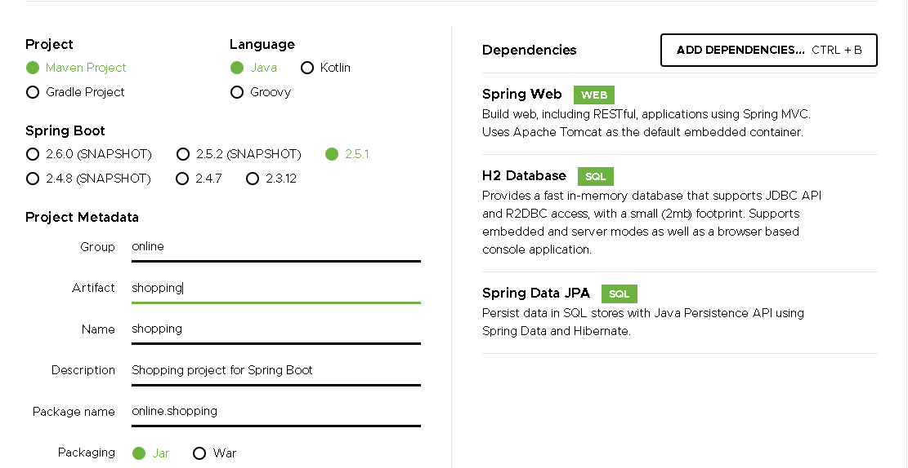
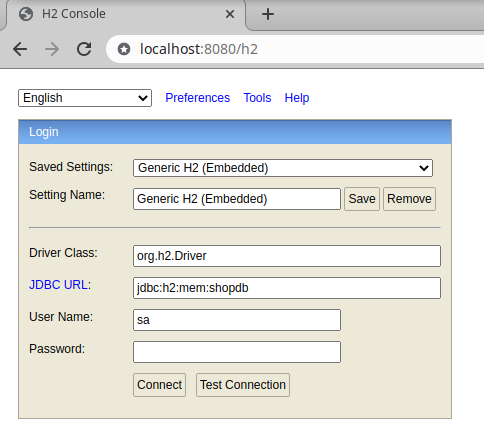
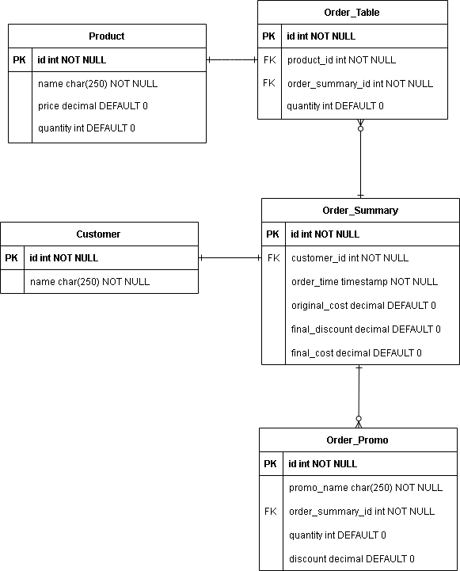
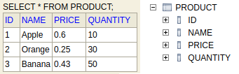
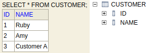
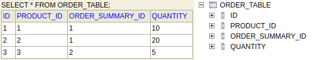
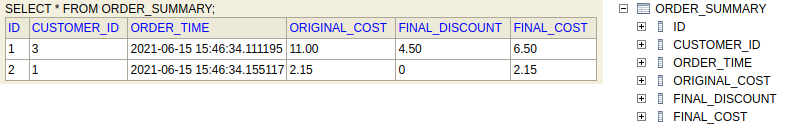

# Web Shopping Order
A RESTful web service allows customers to shop and place orders online.

## Functionalities
* Customer Creation & Enquiry
* Product Creation & Enquiry
* Order Creation & Enquiry

## Skeleton Setup created by [Spring Initializr](#https://start.spring.io/)
* Spring Boot v2.5.1
* Apache Maven v4.0.0
* Java v11
* H2 Database
* Spring Web
* Spring Data JPA



## Install Apache Maven
```bash
sudo apt install maven
```

## Application Start Up
Run command in the `root folder where pom.xml exists`
```bash
mvn spring-boot:run
```
Home page can be access by <http://localhost:8080><br/>
H2 Database Console can be access by <http://localhost:8080/h2><br/>


## Database Diagram


## Sample Table Data and Structure






## Request Links and Unit Test Case Names
### GET
* http://localhost:8080/products<br>
(ProductTests#getAllProductsAPI)
* http://localhost:8080/product/{id}<br>
(ProductTests#getProductByIdAPI)
* http://localhost:8080/customers
* http://localhost:8080/customer/{id}
* http://localhost:8080/customer/{id}/orders<br>
(CustomerOrderTests#getOrdersOfSingleCustomer, CustomerOrderTests#getOrdersOfNotExistCustomer)
* http://localhost:8080/orders<br>
(OrderTests#getAllOrders)
* http://localhost:8080/order/{id}<br>
(OrderTests#getSingleOrder, OrderTests#getNotExistOrder)

### POST
* http://localhost:8080/customer/save
* http://localhost:8080/product/save<br>
(ProductTests#saveProduct)
* http://localhost:8080/order/save<br>
(OrderTests#saveNoOrder, OrderTests#saveSingleOrder, OrderTests#saveMultiOrders)
* http://localhost:8080/order/promo/save<br>
(PromoTests#applyNoPromotion, PromoTests#applySinglePromotion, PromoTests#applyMultiPromotions, )

## Run Unit Tests with Maven
All test classes are implemented under `src/test/java/online/shopping`<br>
Run any of below commands in the `root folder where pom.xml exists`<br>

Run all tests
```bash
mvn test
```

Run a single test class
```bash
mvn -Dtest=ProductTests test
```

Run a multiple test classes
```bash
mvn -Dtest=ProductTests,OrderTests test
```

Run a single test method in a test class
```bash
mvn -Dtest=ProductTests#getAllProductsAPI test
```

Run all test methods that start with 'get*' from a test class
```bash
mvn -Dtest=OrderTests#get* test
```

Run all test methods that start with 'get*' or 'save*' from a test class
```bash
mvn -Dtest=ProductTests#get*+save* test
```

# Reference Websites
* https://start.spring.io
* https://spring.io/guides/gs/actuator-service/
* https://www.geeksforgeeks.org/how-to-create-a-rest-api-using-java-spring-boot/
* https://howtodoinjava.com/spring-boot2/testing/spring-boot-mockmvc-example/
* https://howtodoinjava.com/spring-boot2/h2-database-example/

